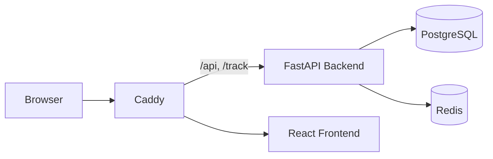

<div align="center">

# 🛡️ HumanShield.APP

**Self-hosted phishing-awareness platform** — plan, send and evaluate simulated phishing campaigns per recipient to make your workforce measurably more resilient against social engineering.


📖 [Deutsche README](README.md)

</div>

---

HumanShield.APP helps organizations shrink their human attack surface: run realistic phishing simulations, track opens/clicks/submissions, and turn the results into targeted awareness training. The platform runs **entirely on your own infrastructure** — all environment-specific values (domain, IdP, SMTP) come from configuration; nothing is hard-coded.

## ✨ Features

**Campaigns & tracking**
- Campaign wizard with optional scheduling
- Tracking of **opens, clicks and form submissions** — evaluated **per recipient**, with a **session history** (repeat visits) per recipient
- **Engagement analytics** — breakdown by browser, operating system, device type and **country** (optional local GeoIP database), UTM parameters and referrer
- Control-center dashboard with **KPIs, risk score (traffic light), funnel, timeline, activity heatmap** and **human-risk score**; **management report** and CSV export

**Content**
- Templates with an **HTML or Markdown editor**, personalization variables and live preview
- **`.eml` import** of real emails, including attachments
- Landing pages with optional form capture, redirect and **live preview in the editor**

**Recipients**
- Groups via **manual entry, CSV or LDAP import**

**Access & security**
- Local login and optional **OIDC / single sign-on**
- **Two-factor authentication** (authenticator app or email code, enforceable, backup codes)
- Roles, audit log, secrets encrypted at rest (Argon2id, Fernet)

**AI assistance** (Business, provider-neutral)
- **AI-assisted creation** of email templates and landing pages via a freely configurable, OpenAI-compatible connection (OpenAI, Azure, Mistral, Groq, OpenRouter, Ollama, etc.)

**Delivery**
- **Sending profiles** (SMTP per sender) plus a global fallback SMTP — any provider

## 🧱 Tech stack

| Layer | Technology |
|---|---|
| Backend | FastAPI · SQLAlchemy · Alembic |
| Frontend | React · Vite · TypeScript · Tailwind CSS |
| Database / cache | PostgreSQL · Redis |
| Proxy / TLS | Caddy |
| Operations | Docker Compose (rootless, hardened) |

## 🚀 Quick start

```bash
git clone https://github.com/securebitsorg/HumanShield.APP.git
cd HumanShield.APP
cp .env.example .env
# fill in .env: SECRET_KEY, database, SMTP, INITIAL_ADMIN_*
docker compose up -d
```

Database migrations run automatically on startup. Then open the dashboard at your configured domain (or `https://localhost`) and sign in with the initial admin defined in `.env`.

> 📌 **Tracking note:** Opens/clicks are only recorded when recipients can reach the address set in `APP_DOMAIN`. Since many mail clients block the open-tracking pixel, **clicks** are the more reliable signal.

## 🏗️ Architecture



Caddy routes `/api/*` and the public tracking endpoints `/track/*` to the backend, everything else to the frontend.

## ⚙️ Configuration

All settings come from `.env` — see [`.env.example`](.env.example) for every option (app, database, SMTP, OIDC, LDAP, licensing). Login, OIDC, LDAP, SMTP and security settings can additionally be managed from the dashboard.

## 🔒 Security

- Passwords hashed with **Argon2id**, runtime secrets (SMTP/LDAP/OIDC/TOTP) encrypted at rest (**Fernet**)
- Two-step login when 2FA is enabled, audit log of sign-ins and system changes
- Operator secrets only via `.env`, never in code

See the [security wiki](https://github.com/securebitsorg/HumanShield.APP/wiki/Sicherheit). Awareness context for **NIS2 & BSI** is in the [corresponding wiki article](https://github.com/securebitsorg/HumanShield.APP/wiki/NIS2-und-BSI).

## 🧩 Editions (open core)

The **core** of HumanShield.APP (all features above) is open source under the **Mozilla Public License 2.0 (MPL-2.0)** and fully usable. In addition there are **two paid add-ons**, unlocked by license and shipped as separate, private packages.

**Business add-on**
- **LDAP** directory import of recipients (incl. LDAPS with a custom CA certificate)
- **Azure AD / Entra ID** import of recipients (Microsoft Graph)
- **Email upload** (`.eml`) as a template draft
- **Template library** (ready-made awareness templates: DHL, Amazon, invoice, M365, HR, bank, PayPal, LinkedIn, PDF lure, QR campaign)
- **Landing page library** — matching, clonable landing pages for every template, available directly in the “Landing pages” menu
- **Attack types** — spear phishing, whaling (CEO fraud) and file-based (lure attachment) templates in the library
- **AI connection** — provider-neutral, OpenAI-compatible generation of email templates and landing pages
- **PDF export** (management report & campaign results)
- **QR code phishing (quishing)** — per-recipient QR codes
- **Webhooks** — event triggers (open/click/submit) to external systems
- **Password capture** — capture submitted form data (passwords masked, never plaintext)
- **Passkeys (WebAuthn)** — phishing-resistant two-factor authentication
- **Business reporting** — executive report (PDF), trend analysis and user development
- **Recurring campaigns** — automatic, scheduled re-send via a scheduler
- **Multi-stage campaigns** — campaign sequences (several stages with a time gap)
- **Evidence center** — separate PDF for **GDPR** (Art. 32), **NIS2** (Art. 21), **ISO 27001** (A.6.3), **awareness record**, **audit report**, **certificate** and **training records**

**Enterprise add-on** (includes all Business features)
- **White-label** — custom branding (app name, accent colors, logo)
- **SAML SSO** — sign-in via SAML 2.0 identity providers (signature-verified assertions)
- **Automatic/risk campaigns** — recipients are chosen automatically by risk and sent at a fixed interval
- **Enterprise reporting** — training progress, certificate status and individual per-person reports (PDF)
- **AI risk analysis** — AI-assisted evaluation of the human-risk metrics
- **SIEM export** — tracking events to Splunk HEC, Elasticsearch, Microsoft Sentinel or generic JSON

Without a license the platform runs as pure open core — no errors, no lockouts.

## 📖 Documentation

Detailed guides in the **[wiki](https://github.com/securebitsorg/HumanShield.APP/wiki)**:
[Installation](https://github.com/securebitsorg/HumanShield.APP/wiki/Installation) ·
[Configuration](https://github.com/securebitsorg/HumanShield.APP/wiki/Konfiguration) ·
[Features](https://github.com/securebitsorg/HumanShield.APP/wiki/Funktionen) ·
[Architecture](https://github.com/securebitsorg/HumanShield.APP/wiki/Architektur) ·
[FAQ](https://github.com/securebitsorg/HumanShield.APP/wiki/FAQ)

## 🤝 Contributing

Contributions are welcome. Please create a branch for your changes, write meaningful commits and open a pull request (see the [PR template](.github/pull_request_template.md)).

## 📄 License

The core is licensed under the **[Mozilla Public License 2.0](LICENSE)** — an OSI-approved open-source license with file-level copyleft: free to use, modify and redistribute (including commercially and as a hosted service); modifications to MPL-licensed files must be released under the MPL. The commercial **enterprise add-ons** are separate and proprietary. Add-on licensing contact: `kontakt@humanshield.app`.

---

<div align="center">

A project by **HumanShield-Awareness UG** · use responsibly for authorized awareness training only.

</div>
