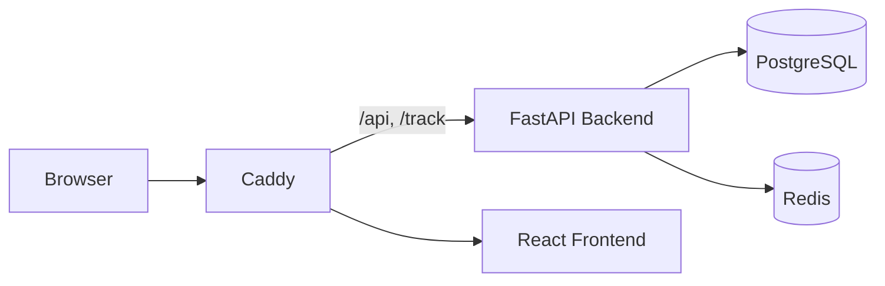

<div align="center">

# 🛡️ HumanShield.APP

**Selbstgehostete Plattform für Phishing-Awareness** — simulierte Phishing-Kampagnen planen, versenden und pro Empfänger auswerten, um Mitarbeitende messbar gegen Social Engineering zu wappnen.


📖 [English README](README.en.md)

</div>

---

HumanShield.APP hilft Organisationen, ihre menschliche Angriffsfläche zu verkleinern: realistische Phishing-Simulationen durchführen, Öffnungen/Klicks/Eingaben nachvollziehen und daraus gezielte Sensibilisierung ableiten. Die Plattform läuft **vollständig bei dir** — alle umgebungsspezifischen Werte (Domain, IdP, SMTP) kommen aus der Konfiguration, nichts ist im Code fest verdrahtet.

## ✨ Funktionen

**Kampagnen & Tracking**
- Kampagnen-Assistent mit optionaler Zeitplanung
- Tracking von **Öffnungen, Klicks und Formular-Eingaben** — ausgewertet **pro Empfänger**
- Control-Center-Dashboard mit **KPIs, Risiko-Score (Ampel), Trichter & Zeitachse**; **Management Report** und CSV-Export

**Inhalte**
- Vorlagen mit **HTML- oder Markdown-Editor**, Personalisierungs-Variablen und Live-Vorschau
- **`.eml`-Import** echter E-Mails inklusive Anhänge
- Landing Pages mit optionaler Formular-Erfassung und Weiterleitung

**Empfänger**
- Gruppen per **manueller Eingabe, CSV oder LDAP-Import**

**Zugang & Sicherheit**
- Lokaler Login und optionales **OIDC / Single Sign-On**
- **Zwei-Faktor-Authentifizierung** (Authenticator-App oder E-Mail-Code, erzwingbar, Backup-Codes)
- Rollen, Audit-Log, Secrets verschlüsselt at-rest (Argon2id, Fernet)

**Versand**
- **Sending Profiles** (SMTP je Absender) plus globales Fallback-SMTP — beliebiger Anbieter

## 🧱 Tech-Stack

| Schicht | Technologie |
|---|---|
| Backend | FastAPI · SQLAlchemy · Alembic |
| Frontend | React · Vite · TypeScript · Tailwind CSS |
| Datenbank / Cache | PostgreSQL · Redis |
| Proxy / TLS | Caddy |
| Betrieb | Docker Compose (rootless, gehärtet) |

## 🚀 Schnellstart

```bash
git clone https://github.com/securebitsorg/HumanShield.APP.git
cd HumanShield.APP
cp .env.example .env
# .env ausfüllen: SECRET_KEY, Datenbank, SMTP, INITIAL_ADMIN_*
docker compose up -d
```

Datenbank-Migrationen laufen beim Start automatisch. Anschließend das Dashboard über die konfigurierte Domain (bzw. `https://localhost`) öffnen und mit dem in `.env` gesetzten Initial-Admin anmelden.

> 📌 **Tracking-Hinweis:** Öffnungen/Klicks entstehen nur, wenn Empfänger die unter `APP_DOMAIN` gesetzte Adresse erreichen können. Da viele Mail-Clients das Öffnungs-Pixel blockieren, sind **Klicks** das verlässlichere Signal.

## 🏗️ Architektur



Caddy leitet `/api/*` und die öffentlichen Tracking-Endpunkte `/track/*` an das Backend, alles Übrige an das Frontend.

## ⚙️ Konfiguration

Sämtliche Einstellungen kommen aus der `.env` — siehe [`.env.example`](.env.example) für alle Optionen (App, Datenbank, SMTP, OIDC, LDAP, Lizenzierung). Login-, OIDC-, LDAP-, SMTP- und Sicherheits­einstellungen lassen sich zusätzlich im Dashboard verwalten.

## 🔒 Sicherheit

- Passwörter mit **Argon2id**, Laufzeit-Secrets (SMTP/LDAP/OIDC/TOTP) verschlüsselt at-rest (**Fernet**)
- Zweistufiger Login bei aktivem 2FA, Audit-Log über Anmeldungen und Systemänderungen
- Betreiber-Secrets ausschließlich über `.env`, nie im Code

Details im [Sicherheits-Wiki](https://github.com/securebitsorg/HumanShield.APP/wiki/Sicherheit). Awareness-Kontext zu **NIS2 & BSI** im [entsprechenden Wiki-Artikel](https://github.com/securebitsorg/HumanShield.APP/wiki/NIS2-und-BSI).

## 🧩 Editionen (Open Core)

Der **Kern** von HumanShield.APP (alle oben genannten Funktionen) ist unter der **Mozilla Public License 2.0 (MPL-2.0)** quelloffen und vollständig nutzbar. Zusätzlich gibt es **zwei kostenpflichtige Add-ons**, die per Lizenz freigeschaltet und als separate, private Pakete ausgeliefert werden.

**Business-Add-on**
- **LDAP**-Verzeichnisimport von Empfängern
- **E-Mail-Upload** (`.eml`) als Vorlagen-Entwurf
- **Vorlagen-Bibliothek** (fertige Awareness-Vorlagen: DHL, Amazon, Rechnung, M365, HR, Bank, PayPal, LinkedIn, PDF-Köder, QR-Kampagne)
- **PDF-Export** (Management Report & Kampagnen-Ergebnisse)
- **QR-Code-Phishing (Quishing)** — QR-Codes pro Empfänger
- **Webhooks** — Event-Trigger (Öffnung/Klick/Submit) an externe Systeme
- **Passwortabfrage** — abgeschickte Formulardaten erfassen (Passwörter maskiert, nie im Klartext)
- **Business-Reporting** — Executive Report (PDF), Trendanalyse und Benutzerentwicklung
- **Wiederkehrende Kampagnen** — automatischer, terminierter Wiederversand per Scheduler
- **Mehrstufige Kampagnen** — Kampagnen-Sequenzen (mehrere Stufen mit zeitlichem Abstand)

**Enterprise-Add-on** (enthält alle Business-Funktionen)
- White-Label, Multi-Tenant, SAML-SSO, AI-Scoring, SIEM-Export u. a.

Ohne Lizenz läuft die Plattform als reiner Open-Core-Betrieb — ohne Fehler, ohne Sperren.

## 📖 Dokumentation

Ausführliche Anleitungen im **[Wiki](https://github.com/securebitsorg/HumanShield.APP/wiki)**:
[Installation](https://github.com/securebitsorg/HumanShield.APP/wiki/Installation) ·
[Konfiguration](https://github.com/securebitsorg/HumanShield.APP/wiki/Konfiguration) ·
[Funktionen](https://github.com/securebitsorg/HumanShield.APP/wiki/Funktionen) ·
[Architektur](https://github.com/securebitsorg/HumanShield.APP/wiki/Architektur) ·
[FAQ](https://github.com/securebitsorg/HumanShield.APP/wiki/FAQ)

## 🤝 Mitwirken

Beiträge sind willkommen. Bitte für Änderungen einen Branch anlegen, aussagekräftige Commits schreiben und einen Pull Request öffnen (siehe [PR-Template](.github/pull_request_template.md)).

## 📄 Lizenz

Der Kern steht unter der **[Mozilla Public License 2.0](LICENSE)** — einer OSI-anerkannten Open-Source-Lizenz mit dateibasiertem Copyleft: frei nutzbar, veränderbar und weiterverteilbar (auch kommerziell und als gehosteter Dienst); Änderungen an MPL-lizenzierten Dateien müssen unter der MPL offengelegt werden. Die kommerziellen **Enterprise-Add-ons** sind davon getrennt und proprietär. Kontakt für Add-on-Lizenzen: `kontakt@humanshield.app`.

---

<div align="center">

Ein Projekt von **HumanShield-Awareness UG** · verantwortungsvoll für autorisierte Awareness-Schulungen einsetzen.

</div>
